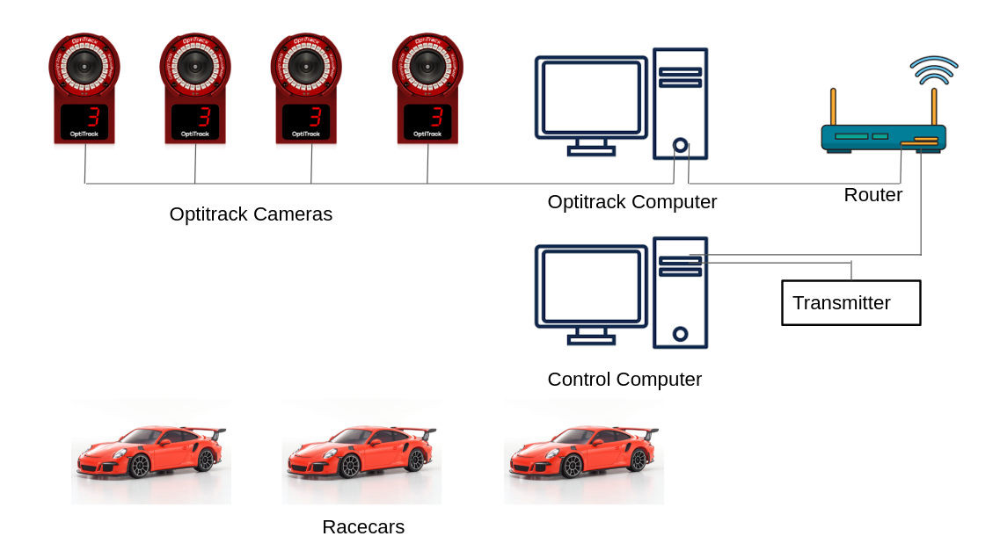
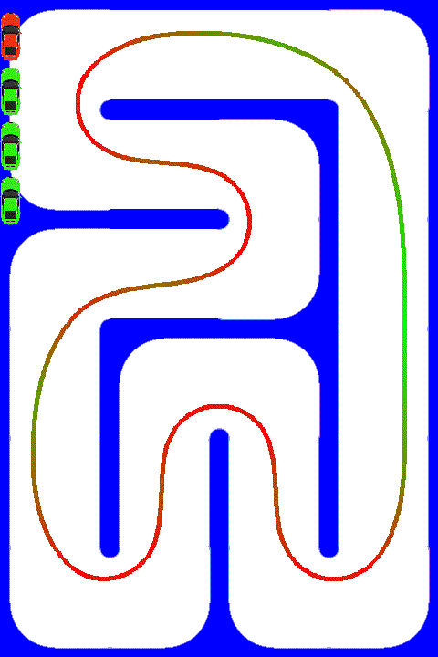

# Buzzracer
This repository contains various resources for the Buzzracer platform developed by DCSL at Georgia Tech. Buzzracer is a 1/24 scale autonomous vehicle platform for education and research. It allows easy portation between lsimulation and hardware, and supports multiple vehicles



## File Structure
The file structure is organized as follows

```
/docs : documents
/log  : experiment/simulation logs
/src  : source code and resources
/src/configs : Config files for preset experiments
/src/extension : extensions that can be loaded when running experiments
/src/controller: controllers
/src/car : car platform related modules
/src/track : Race-track related modules
/src/RL : Reinforcement Learning related modules
/src/util : utilities
/src/data : saved raceline profile, visualization images and other reusable resources
```

## Getting Started

This section will walk you through of getting the codebase running on your local machine

### Clone Repository

First clone this repository

```
git clone https://github.gatech.edu/zzhang615/RC-VIP'
```

or

```
git clone git@github.gatech.edu:zzhang615/RC-VIP.git'
```

depending on which type of authentication you plan to use. If you're accessing through `github.com` instead of `github.gatech.edu`, your address will be different. 

### Install Dependencies

Next thing to do is installing necessary dependencies. The codebase is developed and intended for Linux. However, it can work on Mac and Windows but may need additional steps. 

The code is written for python 3.8+ and requires the following packages:
`scipy, numpy, cv2, xml, cvxopt, PIL, matplotlib, pytorch, pyserial, pickle, gymnasium, pygame, json`

Please install these packages using pip or conda. Note the list may be inconclusive.

If you wish to work on GPU-accelerated algorithms, please also install pycuda. 

### Generate Raceline

Once you have installed all required packages, you need to run `python qpSmooth.py` to generate a raceline profile. You should see some colorful text bring printed and several visualizations of our racetrack with a raceline. Click the 'x' on the upper corners for each visualization to continue the program. When the program finishes, the last two lines should be:

```
testing loading
track and raceline loaded
```

This means the raceline profile have been saved correctly

### Verify Your Installation

To verify everything is working, go to `src/` and run

```
python run.py stanley
```

You should see a simulation of a car running around on screen


`run.py` is the primary entry point for all simulation and experiments, and `stanley` refers to config file`configs/stanley.xml`. The config file contains details of an experiment, for example,  whether to run the experiment in simulation or in real world, which race track to load, how many cars to generate, which controller each car uses, which extension to load etc. `run.py` loads this config file and prepares everything accordingly. 


You can run a different config file, for example, one with multiple vehicles

```
python run.py planner_stanley
```



When you're working on your project, you will likely create a new controller, extension, visualization etc. In order to test your module, you'll create your own config file and place it in `configs/`.

### Extensions

Visualization, logging, laptimer, collision monitor etc. are implemented as extensions. They are located under `extensions/` and can be loaded at runtime if specified in config xml files. Check `extensions/Extension.py` for the standard format

### Next Steps

Now that you have the repository properly set up, it's time to read the sources files to get a better understanding of how everything works together. To get you started, try reading all relevent codes for the first experiment you ran `python run.py stanley`. You can check the relevant config file for the modules it invoked, to give you some ideas, start with the following files:

```
configs/stanley.xml
run.py
extension/Extension.py
extension/__init__.py
extension/Laptimer.py
extension/Visualization.py
extension/Simulator.py
extension/simulator/DynamicSimulator.py
controller/CarController.py
controller/StanleyCarController.py
```

