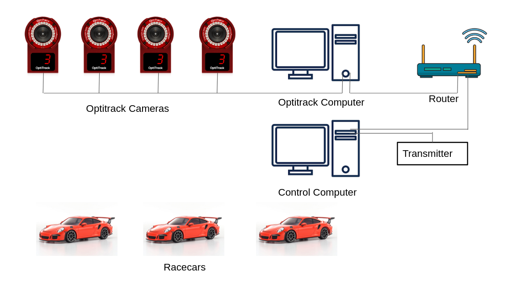
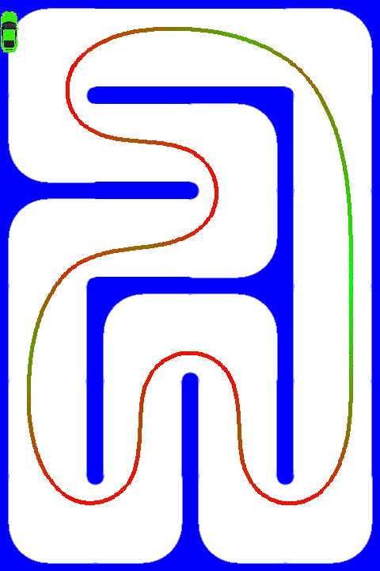
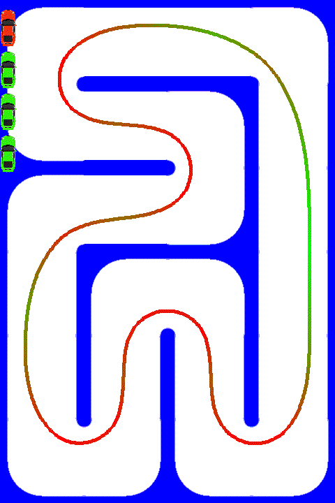

# Buzzracer
This repository contains various resources for the Buzzracer platform developed by DCSL at Georgia Tech. 
Buzzracer is a 1/24 scale autonomous vehicle platform for education and research. 
It allows easy portation between simulation and hardware, and supports multiple vehicles to run simultaneously



## File Structure
The file structure is organized as follows

```
/docs : documents
/log  : experiment/simulation logs
/buzzracer  : source code and resources, in format of a python package
/buzzracer/scripts : Scripts to run, contains all modules you can call directly
/buzzracer/configs : XML Config files for preset experiments
/buzzracer/extensions : extensions that can be loaded when running experiments
/buzzracer/controllers: controllers for car
/buzzracer/cars : car platform related modules
/buzzracer/tracks : Race-track related modules
/buzzracer/RL : Reinforcement Learning related modules
/buzzracer/utilities : utilities
/buzzracer/data : saved raceline profile, visualization images and other reusable resources
```

## Getting Started

This section will walk you through of getting the codebase running on your local machine

The codebase is developed and intended for Linux. 
However, it can work on Mac and Windows but may need additional steps. 

### Clone Repository

First clone this repository

```
git clone https://github.gatech.edu/zzhang615/Buzzracer'
```

or

```
git clone git@github.gatech.edu:zzhang615/Buzzracer.git'
```

depending on which type of authentication you plan to use. 

If you're accessing the public repository through `github.com` instead of `github.gatech.edu`, your URL will be different. 

Note that ssh does not work with `github.gatech.edu` unless you are using campus network or connected to the GT VPN.

### Install Dependencies

```bash
pip install -r requirements.txt
```

Please install these packages using pip.

Please install these packages using pip or conda. Note the list may not be exhaustive.
A `requirements.txt` is  provided containing necessary pip packages. 

If you wish to work on GPU-accelerated algorithms, please also install `pycuda`. 

### Generate Raceline

Once you have installed all required packages, you need to run `python qpSmooth.py` to generate a raceline profile. 
From the root directory of the repository, run:

```bash
python -m buzzracer.scripts.qp_smooth full
```

You should see some colorful text bring printed and several visualizations of our racetrack with a raceline. 
Click the 'x' on the upper corners for each visualization to continue the program. 
When the program finishes, the last two lines should be:

```bash
testing loading
track and raceline loaded
```

This means the raceline profile have been saved correctly

### Verify Your Installation

Since our repo is a python package, you cannot run a python file directly,
 since the imports won't work correctly.
Instead, launch scripts as modules

To verify everything is working, from the root directory of the repository, run

```bash
python -m buzzracer.scripts.run stanley
```

You should see a simulation of a car running around on screen, press `q` twice to quit.
Make sure the visualization is the active window when you press `q`.

Other commands available are

* `q` : First press slows down the car, second press stops the expriment. 
* `b` : Activates a breakpoint
* `s` : Toggles `SnapshotSaver` to save a snapshot, `SnapshotSaver` must be loaded in the config xml.




`scripts.run` is the primary entry point for all simulation and experiments, and `stanley` refers to config file`configs/stanley.xml`.
The config file contains details of an experiment, 
for example,  whether to run the experiment in simulation or in real world, which race track to load, 
how many cars to generate, which controller each car uses, which extension to load etc. 
`run.py` loads this config file and prepares everything accordingly. 

You can run a different config file, for example, one with multiple vehicles

```bash
python -m buzzracer.scripts.run planner_stanley
```



## Contributing

When you're working on your project, 
 you will likely create a new controller, extension, visualization etc. 
In order to test your module, you'll create your own config file and place it in `buzzracer/configs/`.

### Extensions

Visualization, logging, laptimer, collision monitor etc. are implemented as extensions.
They are located under `extensions/` and can be loaded at runtime if specified in config xml files. 
Check `extensions/extension.py` for the base class.

### Next Steps

Now that you have the repository properly set up, 
it's time to read the sources files to get a better understanding of how everything works together. 
To get you started, try reading all relevent codes for the first experiment you ran. 
You can check the relevant config file for the modules it invoked, to give you some ideas, start with the following files:

```bash
buzzracer/configs/stanley.xml
buzzracer/scripts/run.py
buzzracer/extension/extension.py
buzzracer/extension/__init__.py
buzzracer/extension/laptimer.py
buzzracer/extension/visualization.py
buzzracer/extension/simulator.py
buzzracer/extension/simulators/DynamicSimulator.py
buzzracer/controllers/car+controller.py
buzzracer/controllers/stanley_car_controller.py
```

### Tests

Tests are conducted with `pytest`, from `buzzracer/`, run `pytest` to run all tests under `buzzracer/tests`

If you run from the project root directory, pytest will pick up some ill-named non-tests and mark those as failures,
so it's important that you launch from the right folder.

